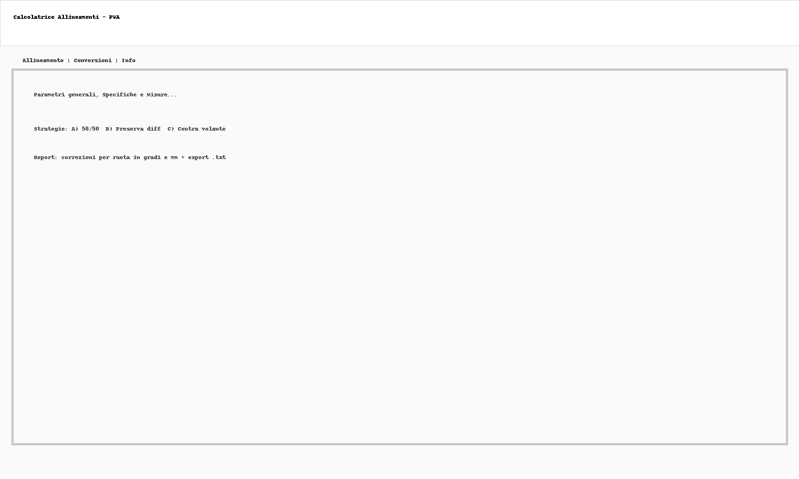

# Calcolatrice Allineamenti (PWA)  
*(Wheel Alignment Calculator – PWA)*

---

## 🇮🇹 Descrizione (Italiano)

**Calcolatrice Allineamenti** è una **Progressive Web App (PWA)** open source progettata per gommisti e officine.  
Permette di calcolare in modo semplice e rapido **camber, caster e toe**, verificare le **tolleranze** e ottenere le **correzioni consigliate** per raggiungere il target di allineamento.  

Funziona **offline** ed è installabile su smartphone, tablet o PC tramite GitHub Pages.  

### ✨ Funzionalità principali
- 3 strategie di correzione toe:
  - **A)** Split 50/50 (volante centrato)  
  - **B)** Preserva differenza L/R  
  - **C)** Centra volante (forza L = R)  
- Conversioni **Toe gradi ↔ mm** (per ruota) al **diametro del cerchio**  
- Generazione ed **export report `.txt`**  
- **Tema scuro automatico** (con toggle manuale)  
- **Gestione preset veicolo** (marca, modello, nome) con salvataggio in `localStorage`  
- **Bilingue IT/EN** (toggle in alto a destra)  
- **Unit test integrati** (`tests.html`) per funzioni di conversione  

### 🛠️ Utilizzo
1. Apri la PWA via GitHub Pages o direttamente con `index.html`  
2. Imposta diametro cerchio, specifiche e misurazioni  
3. Scegli la strategia di correzione e premi **Calcola**  
4. Visualizza il **report** con correzioni per ruota in gradi e mm  
5. Esporta il report in `.txt` o salva i dati come **preset veicolo**  
6. Su smartphone → usa “**Aggiungi alla Schermata Home**” per installare l’app offline  

---

## 🇬🇧 Description (English)

**Wheel Alignment Calculator** is an open-source **Progressive Web App (PWA)** designed for workshops and tire specialists.  
It helps to quickly calculate **camber, caster and toe**, check **spec tolerances**, and get **recommended toe corrections** to reach the target alignment.  

Works **offline** and can be installed on smartphone, tablet or PC via GitHub Pages.  

### ✨ Key Features
- 3 toe correction strategies:
  - **A)** Split 50/50 (center steering)  
  - **B)** Preserve L/R difference  
  - **C)** Center steering (force L = R)  
- Conversion **Toe deg ↔ mm** (per wheel) based on rim diameter  
- Generate and **export `.txt` report**  
- **Dark theme** (auto + manual toggle)  
- **Vehicle preset management** (make, model, name) stored in `localStorage`  
- **Bilingual IT/EN** (toggle available)  
- **Built-in unit tests** (`tests.html`) for conversion functions  

### 🛠️ How to Use
1. Open the PWA via GitHub Pages or directly with `index.html`  
2. Set rim diameter, specs and measurements  
3. Choose correction strategy and press **Compute**  
4. Check the **report** with per-wheel corrections in deg and mm  
5. Export the report as `.txt` or save data as **vehicle preset**  
6. On mobile → use **Add to Home Screen** to install offline  

---

## 🎯 Perché usare questa App

Questa PWA **non sostituisce** una macchina di allineamento professionale:  
non misura direttamente le geometrie, ma è uno **strumento di supporto pratico** per gommisti e officine.

### 🇮🇹 Italiano
- 🔄 **Conversione gradi ↔ mm** — utile quando costruttori e macchine usano unità diverse.  
- ✅ **Check delle specifiche** — conferma indipendente dei limiti camber/caster.  
- 🎚️ **Strategie toe** — supporto per decidere come distribuire le correzioni.  
- 📝 **Report indipendente** — file `.txt` semplice da condividere o archiviare.  
- 📱 **Sempre in tasca** — funziona offline su smartphone/tablet anche senza banca dati.

### 🇬🇧 English
- 🔄 **Degrees ↔ mm conversion** — helpful when specs and aligner speak different units.  
- ✅ **Spec check** — independent confirmation of camber/caster limits.  
- 🎚️ **Toe strategies** — guidance on distributing corrections.  
- 📝 **Independent report** — simple `.txt` file for notes or customers.  
- 📱 **Pocket tool** — works offline on mobile/tablet even without full database.

---

## 📦 Repository structure
- `index.html` → main app interface  
- `style.css` → styles (light/dark)  
- `app.js` → core logic (calculation, strategies, i18n, presets, report)  
- `manifest.json` → PWA manifest  
- `service-worker.js` → offline cache  
- `icons/` → app icons (192px, 512px)  
- `tests.html` + `tests.js` → unit tests for conversion functions  
- `README.md` → project documentation  
- `MANUALE_INSERIMENTO_DATI.md` → manuale rapido IT/EN  
- `screenshot.png` → preview of the app  

---

## 📷 Screenshot

---

## 🌐 GitHub Pages
Dopo aver caricato la repo, abilita **GitHub Pages** in:  
*Settings → Pages → Deploy from a branch → main*  

Il sito è disponibile all’indirizzo:  
`https://www.alessandropezzali.it/CALCOLATRICE-ALLINEAMENTI/`

---

## 🔗 Link utili
- 📚 **Amazon Author – Alessandro Pezzali**: https://www.amazon.it/stores/Alessandro-Pezzali/author/B0FL13X4YR?ref_=pe_2466670_811284380&isDramIntegrated=true&shoppingPortalEnabled=true  
- 🌐 **PezzaliAPP – Suite di App Open Source**: https://www.pezzaliapp.com

---

## 📜 License
© 2025 Alessandro Pezzali – PezzaliAPP  
Rilasciato come progetto open-source a scopo educativo.  
